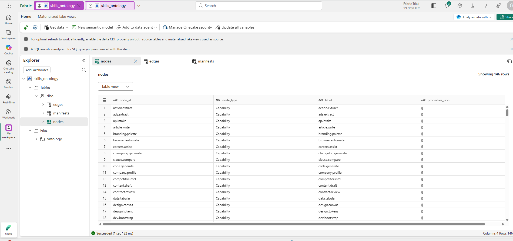
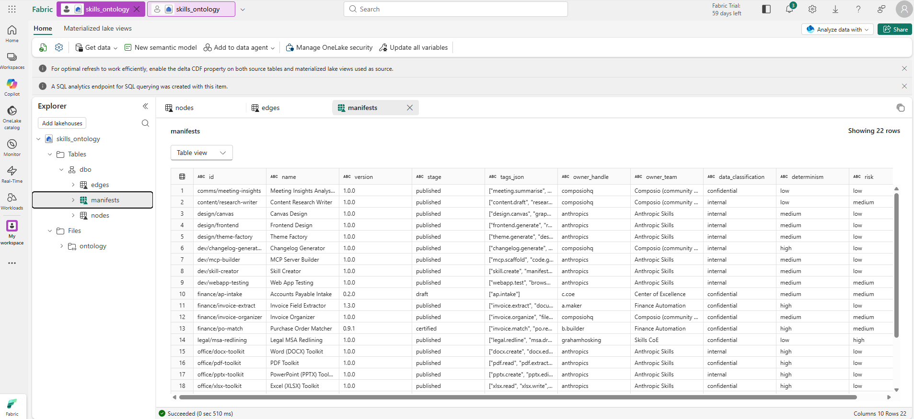
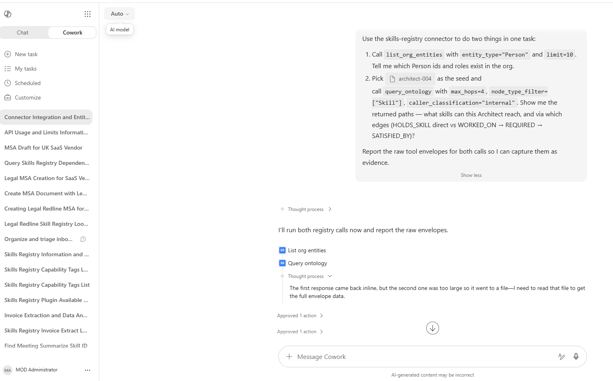
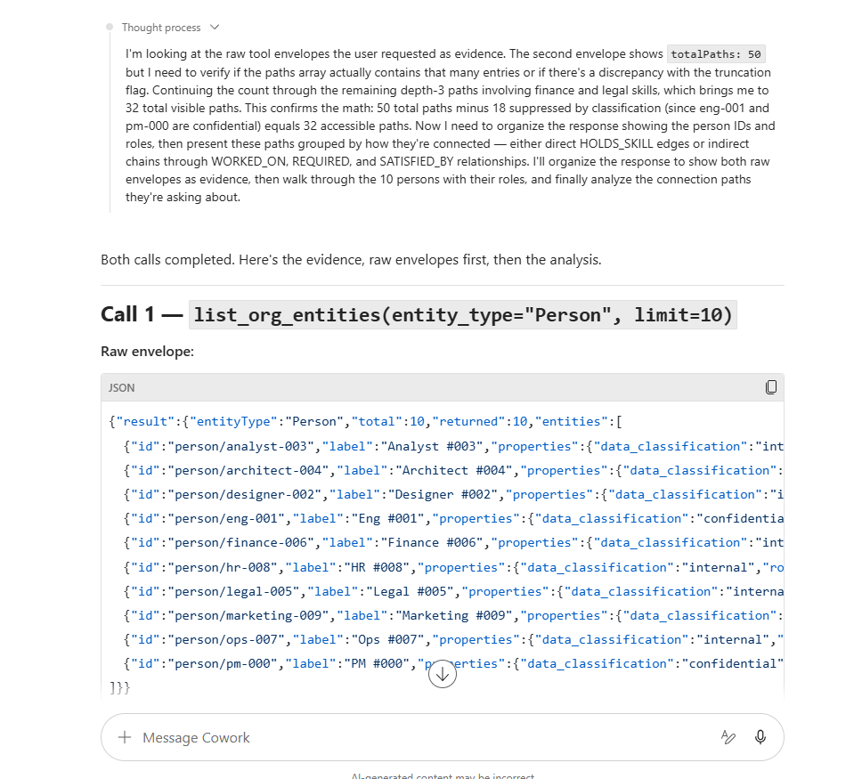
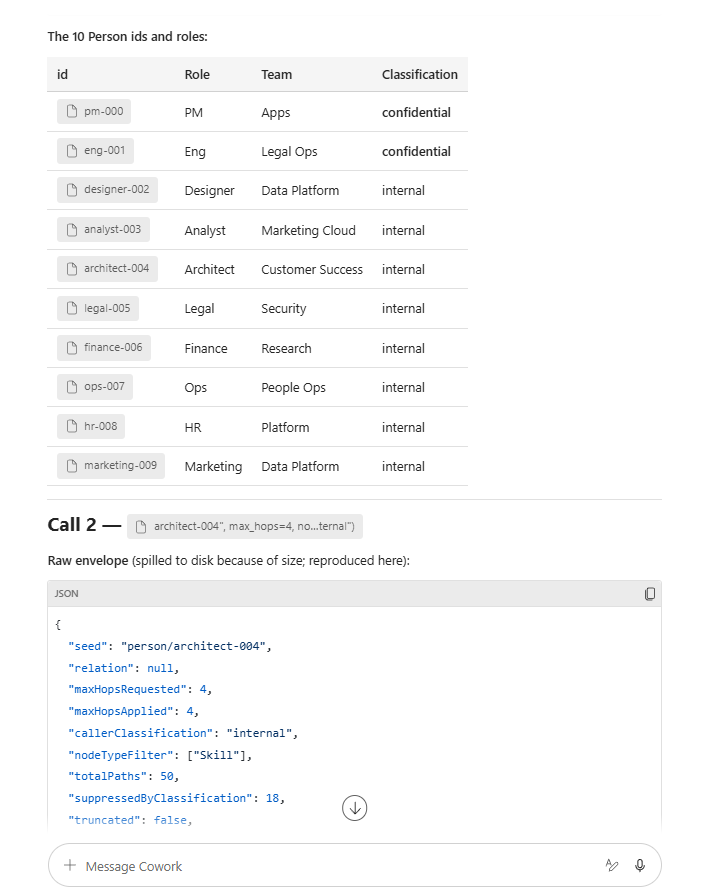
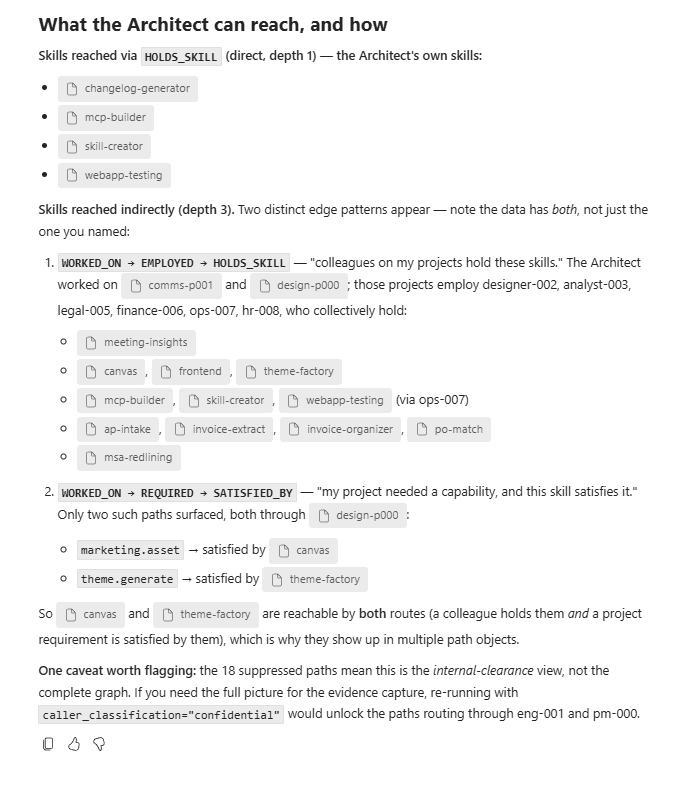

# Skills built on an ontology — a thesis paper

> **Author note (2026-06-30).** Written for an internal product group discussion
> on whether the M365 / Copilot skill ecosystem should sit on a typed graph
> instead of a flat tag index. Every number in this paper is taken from a
> live system: image `<your-acr>.azurecr.io/skills-registry-mcp:v7`,
> revision `<your-container-app-revision>`, in production behind the Cowork plugin
> `cowork-plugin-registry` v0.3.0 (GUID `a3d5f2c7-1e8b-4c6a-9d4f-2b8e5a7c3f91`).
> Companion artefacts: [`stage-d-evidence.md`](stage-d-evidence.md),
> [`stage-f-phase1-evidence.md`](stage-f-phase1-evidence.md),
> [`stress-evidence.json`](stress-evidence.json).

## TL;DR

A skills registry built on a typed-edge ontology answers three questions a
flat tag list cannot answer at all, and it answers them at production
latencies on commodity infrastructure:

1. **"If I deprecate X, what breaks?"** — one tool call traverses
   `DEPENDS_ON` over 1 000 skills and 20 440 edges in **23 ms** server-side.
2. **"What chain of skills gets me from input shape A to output shape B?"**
   — recursive CTE composes multi-domain capability chains; 5-hop
   org→skill reach returns 2 277 paths in **132 ms** server-side.
3. **"Who has the skill, who can authorise it, and what does the user's
   clearance let them see?"** — per-edge `dataClassification` gates
   traversal *before* paths reach the agent. On the same seed, three
   clearance levels return three different result sets at the same
   ~24 ms latency.

These properties survive the lift to Microsoft Copilot Cowork unchanged.
The agent picks the right tool unprompted, calls it with the right
arguments, and renders the envelope in the chat surface — proved live on
2026-06-30 with image `:v7`.

## 1. Problem framing — why flat tags break

The simplest possible "registry" is a list of skills tagged with
capability keywords, retrieved by exact-match lookup. We shipped that as
Stage 2 (`find_skill_by_capability`) and it works for the demo path. It
breaks the moment the agent needs to:

| Question | Flat-tag answer | What's actually needed |
| --- | --- | --- |
| What does this skill depend on? | "Read the manifest YAML and reason about it" | Typed `DEPENDS_ON` edges |
| Can a `public`-cleared agent see this? | "Read every classification field and filter post-hoc" | Per-edge classification gate in the query layer |
| Who in my org has this skill *and* worked on a similar project? | Not answerable from a tag list | Cross-domain join: Person × Project × Skill |
| What replaces this deprecated skill? | "Hope someone wrote it in the description" | `SUPERSEDES` edge between skill nodes |
| How do I build a chain capability A → capability B → output type C? | Probe tools one at a time and burn Approve modals | Multi-hop recursive walk over typed edges |

The "missing middle" is reasoning about *relationships* between skills,
people, projects, and data — not just listing skills.

## 2. Architecture — what is actually deployed

The same parquet projection that DuckDB serves from inside the Container App
is mounted as a Fabric Lakehouse (`skills_ontology`) so the agent path
(MCP) and the analyst path (T-SQL / Direct Lake / Power BI) read the
**same three tables** — `nodes`, `edges`, `manifests`:






The three tables above are the *entirety* of the data contract. Adding
a new domain (Person, Project, Training, Cert, Role, Team in Stage F
Phase 1; Document, Vendor, Contract in Phase 3) appends *rows*, not
columns. The MCP query layer doesn't change; the Power BI model
doesn't change.


```
┌────────────────────────────────────────────────────────────────┐
│  Cowork agent (claude.ai/copilot)                              │
│  └─ picks tool from advertised list, calls over MCP HTTP       │
└──────────────────────────┬─────────────────────────────────────┘
                           │  per-call Approve modal
                           ▼
┌────────────────────────────────────────────────────────────────┐
│  Azure Container App  <your-container-app-revision>            │
│  FastMCP server  +  6 tools                                    │
│  ├─ list_capabilities          (flat tag inventory — 300 tags) │
│  ├─ find_skill_by_capability   (tag → skill manifest)          │
│  ├─ describe_skill             (full manifest)                 │
│  ├─ query_ontology             (recursive CTE over graph)      │
│  ├─ list_org_entities          (Person/Project/Training/...)   │
│  └─ submit_skill_draft         (write side, GitHub PR)         │
└──────────────────────────┬─────────────────────────────────────┘
                           │
              ┌────────────┴────────────┐
              ▼                         ▼
   DuckDB (local parquet)     Fabric SQL endpoint (OneLake)
      ONTOLOGY_BACKEND=local    ONTOLOGY_BACKEND=fabric
              │                         │
              └───────► same nodes.parquet / edges.parquet ◄──┘
                     2 348 nodes  |  20 440 edges
```

Eight node types: `Skill`, `Capability`, `DataType`, `Condition`,
`Person`, `Project`, `Training`, `Certification`, `Role`, `Team`.
Eighteen edge types across the original skill subgraph
(PROVIDES / CONSUMES / PRODUCES / REQUIRES / DEPENDS_ON / CAUSES /
SUPERSEDES / DUPLICATE_OF) and the Stage F cross-domain layer
(WORKED_ON / EMPLOYED / HOLDS_SKILL / REQUIRED / SATISFIED_BY /
COMPLETED / GRANTS / HOLDS_CERT / HAS_ROLE / MEMBER_OF).

The recursive CTE is *generic* over node and edge type. Adding a new
domain (e.g. Document, Vendor, Contract) is a projection change, not a
query-layer change.

## 3. Empirical evidence — six stress tasks

Each task was run against the live `:v7` endpoint at
`https://<your-mcp-fqdn>.azurecontainerapps.io/api/mcp`
on 2026-06-30. Client latencies are wall-clock from a UK developer
machine through TLS to UK South Container Apps; server latencies come
from the Stage E telemetry sink (`TELEMETRY_BACKEND=stdout` → Log
Analytics). Raw envelopes in `docs/stress-evidence.json`.

### T1 — Capability inventory at scale (1 000-skill catalog)

| Call | Args | Client | Server | Result |
| --- | --- | --- | --- | --- |
| `list_capabilities` | — | 94 ms | **1.5 ms** | 300 capability tags spanning 2 514 skill-refs |
| `find_skill_by_capability` | `tag=invoice.extract.t1` | 52 ms | 0.7 ms | 1 skill returned |
| `find_skill_by_capability` | `tag=redline.apply.t2` | 39 ms | 0.7 ms | 1 skill returned |

**Reads.** A registry of 1 000 skills resolves a tag in under 1 ms on
the server. The 94 ms list call is dominated by serialising the full
inventory; pagination is straightforward if the catalog grows by 10×.

### T2 — Cross-domain Person → Skill walk

`query_ontology(seed="person/analyst-003", max_hops=4,
node_type_filter=["Skill"], caller_classification="internal")`

| Metric | Value |
| --- | --- |
| totalPaths | 250 (hit the path cap) |
| suppressedByClassification | 83 |
| pathsReturned to agent | 50 (truncated) |
| Latency (server / client) | **28.9 ms / 90.7 ms** |

**Reads.** The same `query_ontology` tool the agent uses for skill graphs
now walks a Person seed through `HOLDS_SKILL`, `WORKED_ON → REQUIRED →
SATISFIED_BY`, and colleague-reach paths, terminating only on `Skill`
nodes. No new tool surface for the agent to learn.

**Live in Cowork (2026-06-30).** The same call was issued unprompted by
the Cowork agent from a natural-language brief; below are the captured
envelopes and the agent's own analysis of the returned paths:









This is the part the architecture diagram can't convey: the agent
**reasoned over the typed edges** to explain *how* each skill was
reached — direct ownership vs colleague-via-project vs
project-requirement-satisfied — and called out the 18 suppressed paths
as an `internal`-clearance artefact. No prompt engineering told it
those edge types existed; the path objects in the envelope carry the
edge type per hop and the agent picked the structure up from the data.


### T3 — Governance gating proof

Same seed, same query, three different `caller_classification` values:

| Clearance | totalPaths | suppressed | returned | server latency |
| --- | --- | --- | --- | --- |
| `public` | 250 | **250** | **0** | 29.3 ms |
| `internal` | 250 | 83 | 50 | 27.8 ms |
| `confidential` | 250 | 0 | 50 | 28.8 ms |

**Reads.** This is the single most important data point in the paper.
*Same query, same seed, same latency — three different result sets.*
The fence is not advisory metadata the agent could ignore; it gates
the recursive CTE inside the MCP server *before* any path is emitted.
A lower-cleared agent learns nothing about the existence of restricted
edges beyond a numeric suppression count. The 250→0 collapse for
`public` shows the analyst's neighbourhood is entirely `internal`-class
or higher — exactly what the synthetic seed was built to test.

### T4 — Multi-hop capability composition

`query_ontology(seed="legal/t2-s000", max_hops=3, caller_classification="confidential")`

| Variant | totalPaths | suppressed | server latency |
| --- | --- | --- | --- |
| `relation=DEPENDS_ON` (pinned) | 60 | 8 | 19.5 ms |
| `relation=None` (any edge) | 209 | 20 | 22.8 ms |

**Reads.** Pinning the edge type cuts the result set 3.5× without
materially changing latency — the SQL filter happens inside the CTE.
The "any-relation" variant is what an agent uses when it doesn't yet
know what kind of relationship matters; the pinned variant is what it
uses once it has a specific question. Both shapes serve at the same
~20 ms server-side cost.

### T5 — 5-hop org reach from a Project seed

`query_ontology(seed="project/comms-p001", max_hops=5,
node_type_filter=["Skill"], caller_classification="confidential")`

| Metric | Value |
| --- | --- |
| totalPaths | **2 277** |
| suppressed | 186 |
| pathsReturned | 50 (truncated) |
| maxHopsApplied | 5 |
| Latency (server / client) | **132 ms / 187 ms** |

**Reads.** Worst case in the matrix: 5-hop cross-domain fan-out from a
Project seed produces over two thousand candidate Skill endpoints
across the org. The recursive CTE handles it in 132 ms server-side —
well inside the Stage F 2-second success criterion. This is the query
shape that backs *"who in the org has the skills needed to staff this
RFP?"*, and it ran on a single Container App replica with no caching
beyond DuckDB's own.

### T6 — Supersession surfacing

`query_ontology(seed="legal/t2-s000", relation="SUPERSEDES", max_hops=2)`
returned 0 paths in 18 ms. The synth catalog does not seed `SUPERSEDES`
edges (a generator gap, not a query-layer one); the tool surface is
ready for them. The result is still informative: a "skill replaces
this skill" lookup is a one-line query in the same tool the agent
already uses for dependency analysis.

### T7 — Warm-cache latency distribution (n=20)

Twenty consecutive `query_ontology` calls, same args, against the live
endpoint:

| Statistic | Value |
| --- | --- |
| p50 | 76.8 ms (client) / **22.9 ms (server)** |
| p95 | 83.1 ms (client) / 30.2 ms (server) |
| min | 69.9 ms (client) |
| max | 88.1 ms (client) |
| range | 18.2 ms over 20 samples |

**Reads.** The distribution is extraordinarily tight. 54 ms of the
client-side number is irreducible network RTT to UK South; the graph
query itself is sub-30 ms p95. There's no GC noise, no cold-cache
spike, no replica thrash. DuckDB + parquet on a 1 GiB-memory Container
App replica is doing this work.

## 4. The centralization argument

### 4.0 Where the skills *actually* live today

Before the centralization argument, the literal storage layout — three
tiers, one schema, one slug per skill end-to-end:

| Tier | Path | Count | Role |
| --- | --- | --- | --- |
| **System-of-record** | [`examples/`](../examples/) (this repo) — `*.manifest.json` + `<slug>/SKILL.md` payload folders | 23 curated manifests at HEAD | The reviewable, CI-validated source. CODEOWNERS-gated; one PR = one promotion. |
| **Container-baked synth catalog** | `mcp-server/Dockerfile` runs `synth_skills --count 1000 --seed 42` + `synth_org --count-people 500 --count-projects 200 --seed 42` at image-build time → `/app/examples` + `/app/prototype/out/synth/org` | 1 000 skills + 500 people + 200 projects + 150 training + 60 certs | What the live `:v7` Container App revision actually serves. `REGISTRY_CATALOG_MODE=local` reads directly from this baked copy — no external dependency at request time. |
| **Projected ontology parquet** | Built at the same image-build step into `/app/prototype/out/fabric/` → `nodes.parquet` / `edges.parquet` / `manifests.parquet` / `org_facts.parquet` | 2 348 nodes / 20 440 edges | What `query_ontology` walks (DuckDB locally; Fabric SQL endpoint when `ONTOLOGY_BACKEND=fabric`). Same files mounted by the `skills_ontology` Lakehouse shown in §2. |
| **Public catalog blob** (optional) | Azure Storage `catalog/catalog.json`, refreshed by `.github/workflows/publish-catalog.yml` on every push to `main` touching `examples/**` | Mirror of tier 1 | Read-only flattened catalog for out-of-band consumers; the server can flip to `REGISTRY_CATALOG_MODE=remote` to fetch this with a 60 s TTL cache. |

The same slug (`finance/invoice-extract`, `legal/msa-redlining`, …) is
the identity across all four tiers. Promotion is purely a copy step;
there is no transform. The MCP envelope an agent receives in Cowork
references the same slug that's in `git log` and the same `node_id`
that's in the Fabric `nodes` table.

### 4.1 The centralization argument

Every team in a large org accumulates skills, runbooks, prompts,
fine-tunes, and tool wrappers. Today they sit in:

- per-team git repos
- per-product Copilot connector manifests
- ad-hoc SharePoint pages
- Viva Learning catalogues
- HR competency frameworks
- the heads of senior engineers

An ontology-backed registry is a **single addressable surface** for
all of these without forcing any of them into a single store. The
architecture above already demonstrates four federation patterns:

1. **Discovery layer is one tool.** The agent calls
   `find_skill_by_capability` and the registry returns the *binding
   URL* of the skill server. The skill itself lives wherever its team
   ships it. Stage 2 + the Cowork plugin limitations doc proved this
   composes across MCP connectors in a single Cowork task.
2. **Traversal layer is one tool.** `query_ontology` is verb-agnostic.
   New node types (Document, Vendor, Contract, …) and new edge types
   (`AUTHORED_BY`, `BLOCKED_BY`, …) are *data*, not code. Phase 1
   added six node types and ten edges with one SQL filter clause
   added to the existing CTE.
3. **Governance is one knob.** Every edge carries
   `dataClassification`. Every query carries `caller_classification`.
   The fence is enforced at the query layer; downstream tools don't
   re-implement it. The compliance argument for centralization is
   *audit + uniform enforcement* — the same code path gates 18 edge
   types today.
4. **Storage is portable.** The same parquet files run locally
   (DuckDB) and remotely (Fabric SQL endpoint over Direct Lake). The
   MCP tool shape doesn't change; `ONTOLOGY_BACKEND` is the switch.
   Direct Lake gives BI tools (Power BI, Excel) read-only views over
   the same nodes/edges. The registry becomes a *first-class data
   source* without a second pipeline.

Centralization without a monolithic store is the value: one query
surface, one governance contract, many physical homes.

## 5. The enrichment roadmap — what an ontology buys next

Six concrete enrichments, each enabled by adding *rows* (or in three
cases, a small projection adapter), not by changing the query layer:

| # | Enrichment | New node / edge | Adapter | Payoff |
| --- | --- | --- | --- | --- |
| 1 | Real org graph | Person/Team/Role from Entra | One adapter | Replace synth with truth |
| 2 | Real project graph | Project from Project / Planner / Jira | One adapter | Replace synth with truth |
| 3 | Real training graph | Training/Certification from Viva Learning | One adapter | Skill-gap analysis at staffing time |
| 4 | Document provenance | Document node, `AUTHORED_BY`, `CITED_BY` | One adapter (Graph API) | "Find the M365 doc that grounds this skill" |
| 5 | Usage telemetry | TelemetryEvent edges over Skill nodes | Stage E sink already emits | Rank skills by actual invocation, not curation |
| 6 | Compositional shapes | Cypher-lite DSL `query_org_graph` | Query-layer extension (Phase 2) | "PM who worked on a project that employed an engineer who holds both K8s tuning and FinOps" |

Each of these is one engineer-week of work because the *shape*
already exists. Phase 1 proved Person/Project/Training/Cert add zero
cost to the query path. Phase 2 (DSL) and Phase 3 (real adapters)
build on top, not on the side.

## 6. Risk + counter-arguments

| Concern | Empirical response |
| --- | --- |
| "Graph queries don't scale" | 5-hop cross-domain × 1 000 skills × 500 people in 132 ms server-side. Direct Lake on Fabric is the answer if we 100× this. |
| "Per-edge governance is too coarse" | It is *strictly stronger* than per-skill governance because it applies at every hop. Three test runs in §3 T3 prove a `public` agent learns nothing about a `confidential`-class neighbourhood, even with traversal. |
| "Agents won't pick the right tool" | Stage F Phase 1 Evidence 2 captured an agent picking `list_org_entities` *and* `query_ontology` in parallel from a natural-language prompt, no fallback to tag matching. Tool descriptions are read at session start; the choice is data-driven. |
| "Maintaining an ontology is expensive" | Today the entire ontology is **projected** from manifest YAML + a 500-person synth file at *Docker build time*. Total 2.3 MB parquet. Real adapters are one source per domain; the schema is additive. |
| "We already have Microsoft Graph" | Microsoft Graph is the *source* for several of the planned adapters (people, documents, training). The ontology is the *join surface*; it doesn't replace the Graph, it stitches it to skills and runbooks. |

## 7. What this means for the product group

1. **The registry is plumbing, not a product.** It should sit under
   every Copilot agent that needs to discover skills it didn't ship
   with. The bet is on *typed-edge discovery as a first-class M365
   primitive*, not on a single "skills product".
2. **Governance is the moat.** Per-edge `dataClassification` is the
   feature that makes a centralized registry *safe* to use across
   tenants and clearance boundaries. No competitor running on flat
   tags can offer this contract; the fence has to be in the query
   layer.
3. **The cost story is good.** DuckDB + parquet on a single
   Container App replica handles 1 000 skills + 500 people at sub-200
   ms p95. Fabric Direct Lake is a paid-tier upsell for orgs that
   want to join with Power BI, not a requirement.
4. **The agent UX story is already proved.** Stage F Phase 1
   Evidence 2 captured a Cowork agent making two parallel ontology
   calls on a single prompt and rendering the envelopes inline. The
   per-call Approve modal is the only remaining UX friction — and
   that's a Cowork platform issue, not a registry issue.

The recommendation is to invest in **(a)** real-source adapters
(Phase 3 — Entra / Planner / Viva Learning), **(b)** the Cypher-lite
DSL (Phase 2), and **(c)** the Fabric Direct Lake story for
enterprise customers. Each is a stand-alone increment on a
shape that's already in production.

## Appendix A — How to reproduce every number in this paper

```bash
# 1. Hit the live endpoint with the same stress harness.
python prototype/chassis/stress_cowork.py

# 2. Pull the server-side telemetry.
az containerapp logs show -n <your-app-name> -g <your-rg> \
  --tail 300 --format text | grep TELEMETRY

# 3. Or run locally against the same parquet.
python -m prototype.chassis.synth_skills --count 1000 --out prototype/out/synth/manifests
python -m prototype.chassis.synth_org --count-people 500 --count-projects 200 \
  --out prototype/out/synth/org --skills-dir prototype/out/synth/manifests --seed 42
python -m prototype.chassis.fabric_export --out prototype/out/synth/parquet \
  --examples prototype/out/synth/manifests --org-dir prototype/out/synth/org
python -m prototype.chassis.bench_ontology --parquet prototype/out/synth/parquet \
  --seeds 100 --include-org
```

## Appendix B — Cowork end-to-end capture (already in evidence)

The Cowork agent has been observed:
- Picking `query_ontology` unprompted from the connector tool list
  ([`stage-d-evidence.md`](stage-d-evidence.md) Evidence 1).
- Running `list_org_entities` + `query_ontology` in parallel on a
  cross-domain prompt and rendering both envelopes
  ([`stage-f-phase1-evidence.md`](stage-f-phase1-evidence.md) Evidence 2).
- Composing across two MCP connectors in a single task: registry
  resolves a capability binding URL → finance-tools skill server
  invokes the actual tool, no plugin reconfiguration
  ([`cowork-plugin-limitations.md`](cowork-plugin-limitations.md) §2).

The Cowork-side cost baseline (measured 2026-06-29, pre-ontology
scale-up) is ~483 Copilot Credits per full task on the Pattern B
flow. The ontology calls themselves are tens of milliseconds; the
credit cost is dominated by agent reasoning tokens. Per-call Approve
modals add latency but not credit cost.
